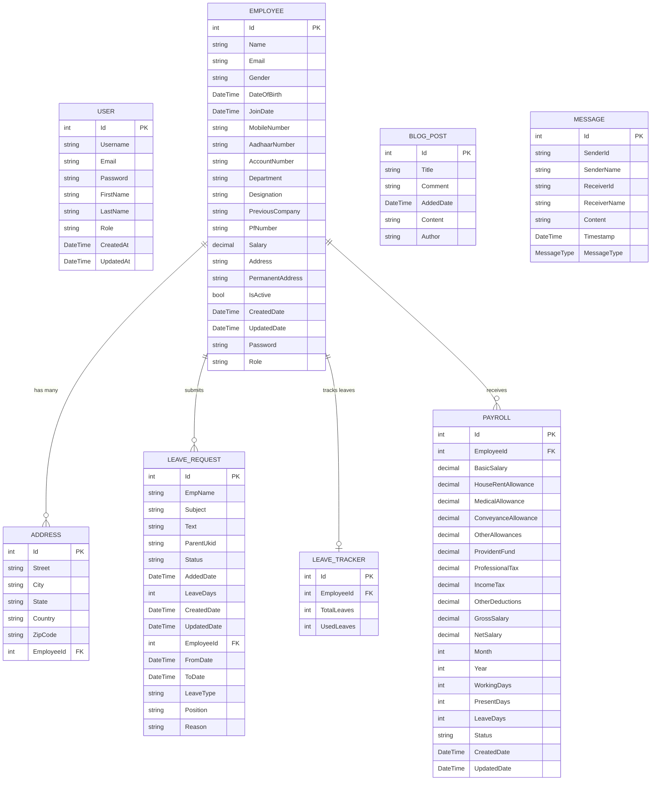

# HR Management Portal - ER Diagram & Normalization Analysis

## Entity-Relationship Diagram



## Entity Details

### 1. USER
- **Primary Key**: Id (int)
- **Purpose**: Authentication and basic user management
- **Attributes**: Username, Email, Password, FirstName, LastName, Role, CreatedAt, UpdatedAt

### 2. EMPLOYEE
- **Primary Key**: Id (int)
- **Purpose**: Core employee information and HR management
- **Computed Field**: EmployeeId => "EMP" + Id.ToString("000") (Not stored in DB)
- **Attributes**: Complete employee profile including personal, professional, and financial details

### 3. ADDRESS
- **Primary Key**: Id (int)
- **Foreign Key**: EmployeeId (references Employee.Id)
- **Purpose**: Employee address management (supports multiple addresses per employee)
- **Relationship**: Many-to-One with Employee

### 4. LEAVE_REQUEST
- **Primary Key**: Id (int)
- **Foreign Key**: EmployeeId (optional, references Employee.Id)
- **Purpose**: Leave application and approval workflow
- **Relationship**: Many-to-One with Employee

### 5. LEAVE_TRACKER
- **Primary Key**: Id (int)
- **Foreign Key**: EmployeeId (references Employee.Id)
- **Purpose**: Track employee leave balance
- **Computed Field**: AvailableLeaves => TotalLeaves - UsedLeaves (Not stored in DB)
- **Relationship**: One-to-One with Employee

### 6. PAYROLL
- **Primary Key**: Id (int)
- **Foreign Key**: EmployeeId (references Employee.Id)
- **Purpose**: Employee salary and payroll management
- **Relationship**: Many-to-One with Employee (multiple payroll records per employee for different months)

### 7. BLOG_POST
- **Primary Key**: Id (int)
- **Purpose**: Company blog/announcements system
- **Independence**: No foreign key relationships (standalone entity)

### 8. MESSAGE
- **Primary Key**: Id (int)
- **Purpose**: Internal messaging system
- **Note**: Uses string IDs for sender/receiver (not enforced foreign keys)
- **Enum**: MessageType (Text, Image, File, System)

## Database Relationships

### One-to-Many Relationships:
1. **Employee → Address** (1:N)
   - One employee can have multiple addresses
   - Cascade delete enabled

2. **Employee → LeaveRequest** (1:N)
   - One employee can submit multiple leave requests
   - Optional relationship (nullable foreign key)

3. **Employee → Payroll** (1:N)
   - One employee can have multiple payroll records (monthly)
   - Cascade delete enabled

### One-to-One Relationships:
1. **Employee → LeaveTracker** (1:1)
   - Each employee has one leave tracker
   - Cascade delete enabled

### Independent Entities:
1. **User** - Standalone authentication entity
2. **BlogPost** - Standalone content entity
3. **Message** - Uses string references (not enforced FK)

## Normalization Analysis

### Current Normalization Level: **2NF (Second Normal Form)** with some **3NF** characteristics

### 1st Normal Form (1NF) ✅ **ACHIEVED**
- ✅ All tables have primary keys
- ✅ All attributes contain atomic (indivisible) values
- ✅ No repeating groups or arrays in single columns
- ✅ Each row is unique

### 2nd Normal Form (2NF) ✅ **ACHIEVED**
- ✅ Meets 1NF requirements
- ✅ All non-key attributes are fully functionally dependent on primary keys
- ✅ No partial dependencies (all tables have single-column primary keys)

### 3rd Normal Form (3NF) ⚠️ **PARTIALLY ACHIEVED**
- ✅ Meets 2NF requirements
- ⚠️ **Issues Found**:

#### **Normalization Violations:**

1. **Employee Table - Transitive Dependencies**:
   - `Department` and `Designation` could be normalized into separate tables
   - `PreviousCompany` could be normalized if company details are needed
   - Address information is duplicated (both `Address` and `PermanentAddress` strings exist alongside the Address entity)

2. **LeaveRequest Table - Data Redundancy**:
   - `EmpName` is stored as string instead of using Employee relationship properly
   - `Position` might be redundant with Employee.Designation
   - Both `Subject` and `Text` with `Reason` create redundancy

3. **Message Table - Denormalization**:
   - `SenderName` and `ReceiverName` are stored redundantly
   - Could reference User or Employee tables instead

4. **BlogPost Table - Missing Normalization**:
   - `Author` is stored as string instead of referencing User/Employee

### Normalization Recommendations

#### **To Achieve Full 3NF:**

1. **Create Reference Tables**:
```sql
-- Department Table
CREATE TABLE Departments (
    Id INT PRIMARY KEY,
    Name VARCHAR(100),
    Description TEXT
);

-- Designation Table  
CREATE TABLE Designations (
    Id INT PRIMARY KEY,
    Title VARCHAR(100),
    Level VARCHAR(50),
    DepartmentId INT FOREIGN KEY
);

-- Company Table
CREATE TABLE Companies (
    Id INT PRIMARY KEY,
    Name VARCHAR(200),
    Industry VARCHAR(100)
);
```

2. **Modify Employee Table**:
```sql
ALTER TABLE Employee 
ADD DepartmentId INT FOREIGN KEY,
    DesignationId INT FOREIGN KEY,
    PreviousCompanyId INT FOREIGN KEY;
    
-- Remove redundant columns
ALTER TABLE Employee 
DROP COLUMN Department, Designation, PreviousCompany, Address, PermanentAddress;
```

3. **Fix LeaveRequest Table**:
```sql
ALTER TABLE LeaveRequest 
DROP COLUMN EmpName, Position;
-- Make EmployeeId required
ALTER TABLE LeaveRequest 
ALTER COLUMN EmployeeId INT NOT NULL;
```

4. **Normalize Message Table**:
```sql
ALTER TABLE Message
ADD SenderUserId INT FOREIGN KEY,
    ReceiverUserId INT FOREIGN KEY;
DROP COLUMN SenderName, ReceiverName;
```

### Current Benefits of Design:

1. **Performance Optimized**: Some denormalization for read performance
2. **Flexibility**: Address entity allows multiple addresses per employee
3. **Audit Trail**: Proper timestamp tracking across entities
4. **Data Integrity**: Foreign key constraints with cascade delete
5. **Precision**: Proper decimal precision for financial data (18,2)

### Areas for Improvement:

1. **Reduce Redundancy**: Normalize department, designation, and company data
2. **Strengthen Relationships**: Make foreign keys more consistent
3. **Data Integrity**: Add proper constraints and validation
4. **Indexing**: Add indexes on frequently queried columns (Email, EmployeeId, etc.)

## Conclusion

The current database design is well-structured and follows **2NF** with good relational integrity. While it has some **3NF** violations for performance reasons, the design is practical for an HR management system. The identified normalization opportunities can be implemented gradually based on system requirements and performance considerations.
